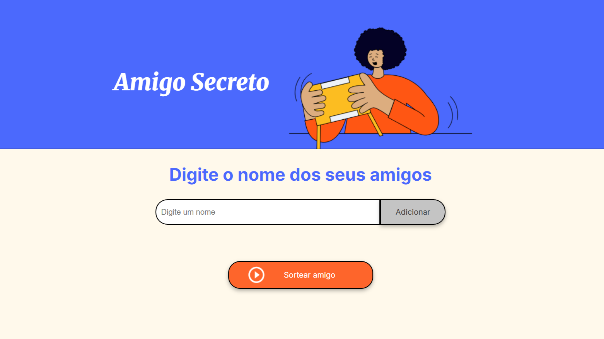
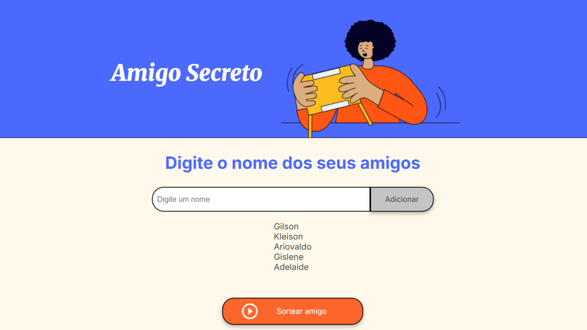
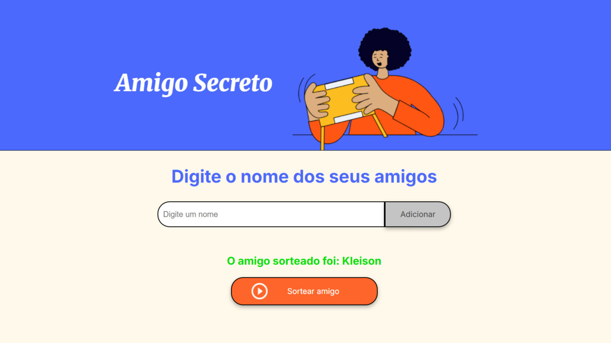

# Challenge "Amigo Secreto"

## Desafio prático do programa ONE - Oracle Next Education

Neste desafio, será criado um sorteador de amigo secreto. O programa deverá exibir uma lista de participantes e selecionar um amigo. Para a criação do programa, foi utilizado HTML, CSS e JavaScript, além dos conhecimentos de lógica de programação ensinados nos cursos sobre lógica, funções, listas e condições.

## Tecnologias utilizadas

## Como funciona esse projeto?

No campo "Digite um nome", você colocará os nomes dos amigos participantes do sorteio. Após inserir o nome desejado, clique no botão "Adicionar".

Isso fará com que o nome seja adicionado à lista de participantes que será criada abaixo do campo "Digite um nome". Repita esse processo até adicionar todos os amigos.

Após adicionar todos os amigos, clique no botão "Sortear amigo". O programa irá selecionar um amigo aleatório e exibir o nome dele na tela.

